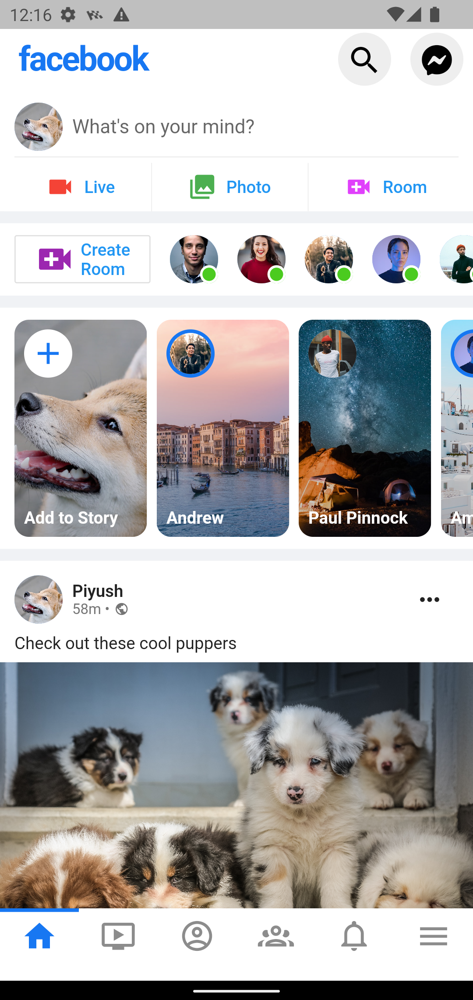
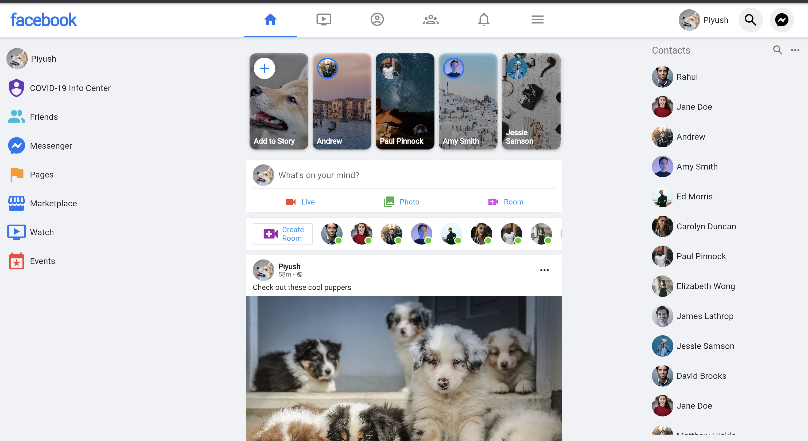

# facebook_reponsive

A responsive Facebook UI made in flutter .

This is a Flutter project that demonstrates how to use a single code base to make a Facebook dashboard for both mobile and web platforms.

Description
This project showcases how to use Flutter to build a responsive user interface that can adapt to different screen sizes, including mobile devices and web browsers. It uses Flutter's widgets and layout system to create a dashboard that displays data from a mock Facebook API.

The project also includes examples of how to use Flutter's routing system to navigate between different pages, as well as how to implement custom themes and fonts to achieve a consistent look and feel across the app.

  

  

